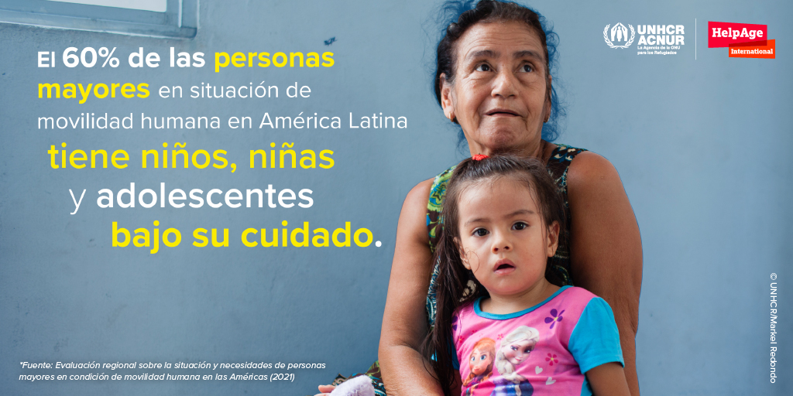
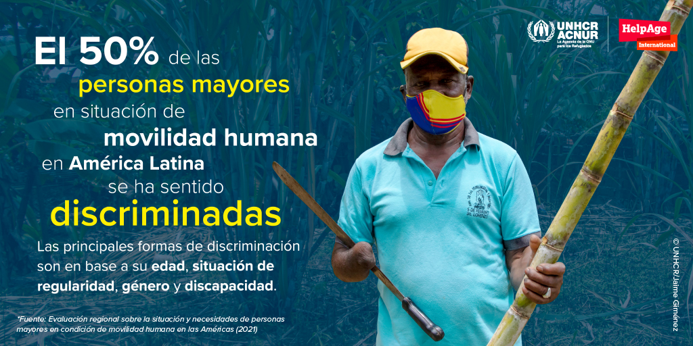
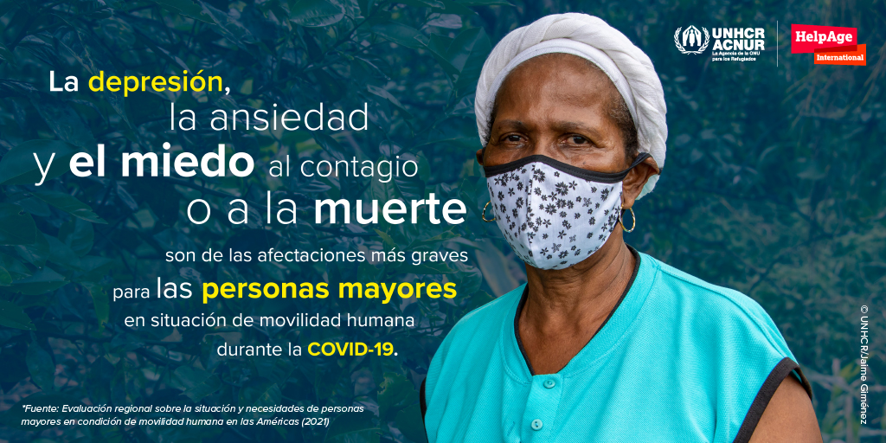

<link rel="shortcut icon" href="images/favicon.ico" type="image/x-icon">
<script type="text/javascript" src="//platform.twitter.com/widgets.js"></script>

<script src="//ajax.googleapis.com/ajax/libs/jquery/1.10.2/jquery.min.js"></script>
<script type='text/javascript'>
$(document).ready(function() {
  $('.tweetable').each(function() {
     var sentence = $(this);
     var permalink = sentence.parents('.post-outer').find('.timestamp-link').attr('href') || $(location).attr('href');
     var tweetable = sentence.text();
     var result = encodeURIComponent(tweetable);
     var link = encodeURIComponent(permalink);
     
sentence.wrap('<a class="tweet-link" href="https://twitter.com/intent/tweet?text=' + result + " " + link +'"></a>');
    });
});
</script>

<!-- Google Tag Manager -->
<script>(function(w,d,s,l,i){w[l]=w[l]||[];w[l].push({'gtm.start':
new Date().getTime(),event:'gtm.js'});var f=d.getElementsByTagName(s)[0],
j=d.createElement(s),dl=l!='dataLayer'?'&l='+l:'';j.async=true;j.src=
'https://www.googletagmanager.com/gtm.js?id='+i+dl;f.parentNode.insertBefore(j,f);
})(window,document,'script','dataLayer','GTM-W55KLNP');</script>
<!-- End Google Tag Manager -->
 
 
 
<!-- Google Tag Manager (noscript) -->
<noscript><iframe src="https://www.googletagmanager.com/ns.html?id=GTM-W55KLNP"
height="0" width="0" style="display:none;visibility:hidden"></iframe></noscript>
<!-- End Google Tag Manager (noscript) -->


```{r setup, include=FALSE}
knitr::opts_chunk$set(echo = FALSE)

# Learn more about creating websites with Distill at:
# https://rstudio.github.io/distill/website.html

# Learn more about publishing to GitHub Pages at:
# https://rstudio.github.io/distill/publish_website.html#github-pages

library(knitr)

library(metathis)

meta() %>%
  meta_social(
    title = "A dignity claim: Ageing on the move",
    description = "Making ageing persons visible to enhance comprehensive actions in humanitarian responses",
    url = "https://ageingonthemove.org",
    image = "https://raw.githubusercontent.com/unhcr-americas/ageingonthemove/main/images/macr/SPA_MACRO-1.jpg",
    image_alt = "A dignity claim: Ageing on the move",
    og_type = "website",
    og_author = "ACNUR",
    twitter_card_type = "summary",
    twitter_creator = "@acnur"
  )

```


## Introducción

Es muy poca la información que hay sobre las personas mayores en situación de movilidad humana en la región Latinoamericana. Esta es la primera evaluación regional que hace un análisis a profundidad sobre la interseccionalidad entre vejez y movilidad humana. La situación actual de la pandemia por COVID-19 también es analizada, incluyendo el empeoramiento del acceso a derechos y servicios y el impacto en sus vidas.  

La evaluación se concentra en __cinco países de la región: El Salvador, Honduras, Colombia, Ecuador y Perú__. Diferentes datos son proporcionados en América Central y en la región Andina, destacando las situaciones que enfrentan  las personas mayores en movilidad humana en estos dos contextos diferentes.  

El Salvador y Honduras están caracterizados principalmente por desplazamientos internos como resultado de la violencia de grupos armados o maras, retornos y dificultades socioeconómicas causadas por la pandemia. Mientras que Colombia, Ecuador y Perú están caracterizados por movimientos mixtos (personas refugiadas y migrantes) como resultado de la crisis política, de derechos humanos y socioeconómica actual en Venezuela, lo que ha llevado a un éxodo de millones de personas. 

<aside>Un total de 725 personas mayores fueron consultadas vía telefónica, incluyendo cuidadores/as, proveedores de servicios y actores clave, con entrevistas a profundidad y semiestructuradas y encuestas en línea</aside>

A pesar de que ambos contextos presentan dificultades diferentes, las personas mayores en situación de movilidad humana se enfrentan a limitaciones similares para acceder a derechos y servicios.

Con este reporte, [HelpAge](http://www.helpagela.org/) y [ACNUR](https://www.acnur.org/) buscan dar luz a las dificultades y riesgos enfrentados por las personas mayores en situación de movilidad humana para que se tomen acciones que aseguren no sean las grandes olvidadas. 

## Llamado a la acción 

Se hace un llamado a la comunidad internacional para incluir a las personas mayores en situación de movilidad humana como un grupo prioritario en todas sus agendas, adaptando y financiando la estructura institucional que responda a sus necesidades. Esto se debe traducir en respuestas y programas humanitarios que incluyan a las personas mayores en situación de movilidad humana como beneficiarias directas s, que garanticen su dignidad, autonomía, independencia y participación, evitando intervenciones que las expongan a situaciones de dependencia, abuso y discriminación. 

 1.  Las personas mayores desplazadas forzosamente se han encontrado durante mucho tiempo con una protección insuficiente y con negligencia. Su __inclusión completa en las respuestas nacionales__ a la pandemia es clave para salvaguardar su dignidad y derechos.

 2.  A parte de incrementar el apoyo humanitario, las personas mayores en situación de movilidad humana necesitan mayores __oportunidades de medios de vida__ para ser financieramente independientes. 

 3.  Es necesario implementar mecanismos de participación, consulta y retroalimentación para el diseño, planeación e implementación de las respuestas humanitarias, de esta manera, las __voces de las personas mayores__  en situación de movilidad humana son escuchadas y sus experiencias y resiliencia son reconocidas como valores agregados a estas respuestas. 

 4.  A nivel global, se hace un llamado a los Estados para que impulsen el proyecto de redactar y adoptar una Convención Internacional de Naciones Unidas para la Protección de las Personas Mayores, liderado por el [Grupo de Trabajo de Composición Abierta](https://social.un.org/ageing-working-group/). A nivel regional, es importante que los Estados adhieran e implementen la [Convención Inter-amerícana para la Protección de los Derechos de las Personas Mayores](http://www.oas.org/en/sla/dil/inter_american_treaties_a-70_human_rights_older_persons.asp), como __marco legal__ vigente para todos los Estados americanos, adecuando sus ordenamientos internos a la luz de este instrumento y de otros marcos de protección pertinentes del Derecho Internacional y Regional de los Derechos Humanos.


<div class="parallax parallax1"><div class="parallax-content">
## ¿Cuáles son los riesgos de protección y desafíos que enfrentan las personas mayores en situación de movilidad humana en las Américas? 
</div></div>
 


### Vivir sin documentación, ni información por meses

Las personas mayores consultadas mencionaron no poder completar los trámites de regularización y gestionar sus documentos, ya sea por estar solas (11% de todas las personas viven solas) o  por un tema de distancia o acceso (67% de la población mayor indica que tiene dificultades de acceso y movilidad en el transporte público).

<aside>La falta de información sobre procedimientos es otro desafío reportado en la región Andina.</aside>

Las personas mayores en la región Andina son las más afectadas por la falta de documentación: 24% de todos las entrevistadas no contaban con documentación. Esta cifra aumenta entre personas con discapacidad, lo que incrementa su vulnerabilidad. También se encuentra una diferencia de género: 27% de las mujeres no contaban con documentación en lo absoluto, comparado con el 19% de hombres. En esta región, a pesar de que el porcentaje de aquellas en necesidad de protección internacional es alto, el porcentaje de personas reconocidas con la condición de refugiado es bajo, representando solo el 9% de la entrevistadas. Muchas personas venezolanas, por distintas razones, optan por otros tipos de regularización en los países de acogida.

>  “Nosotros solicitamos la cita de refugio y la dieron para el 2022”.
>  -- Mujer (67) en Perú, 2020  

### Muchas tienen acceso limitado a servicios de salud


 42% de las personas encuestadas no están recibiendo tratamiento para diferentes condiciones meédicas, ya sea por citas perdidas, falta de documentación, falta de dinero para pagar las medicinas o miedo a acercarse a los centros de salud por riesgo de contagio. Dificultades de movilidad o largas distancias a los centros de salud son razones muy poco utilizadas.

<aside>En promedio, alrededor de 30% de las personas mayores consultadas no usaban servicios de salud cuando los necesitaban, incluso antes de la pandemia.</aside>

Más de un quinto de aquellos que usaban servicios de salud han tenido que pagar, lo que, dado la severa condición financiera de la mayoría de las personas mayores en condición de movilidad humana, gravemente limita su habilidad para acceder a los servicios que necesitan. 

```{r, layout="l-body"}
include_graphics("images/info/condition.png", dpi = NA)
```

La mayoría de las personas mayores consultadas reportaron tener acceso limitado a servicios de salud durante la pandemia. Cuarenta y dos por ciento no estaban recibiendo tratamiento para condiciones de salud previas y 6% de aquellos infectados con COVID-19 reportaron no recibir tratamiento médico adecuado. 

Casi 27% de las personas entrevistadas reportaron no tener acceso a ningún servicio de salud y 98% reportó tener al menos una condición de salud o discapacidad.

### Pérdidas de trabajo y falta de ingresos

Refugiados mayores han sido privados de su autonomía financiera y muchos han perdido sus trabajos y fuentes de ingreso y se han vuelto dependientes en ayuda humanitaria mayormente inexistente. 


```{r, layout="l-body"}
include_graphics("images/info/eco.png", dpi = NA)
```

Un 64% de las personas mayores en situación de movilidad humana no tenían ingresos mensuales antes de la pandemia. De quienes tenían ingresos, el 62% sentía que no era suficiente para cubrir sus necesidades.

A pesar de su incrementada vulnerabilidad, las personas mayores en situación de movilidad humana se han convertido en cabezas de hogar a medida que continuaban teniendo familiares en su cuidado, incluyendo niños, niñas y adolescentes (60%), adultos (38%), personas mayores de 60 años (20%) y personas con discapacidad (5%).

 
```{r, layout="l-page"}

```


### Un cuarto de las personas mayores consultadas no están comiendo tres comidas al día. 

El acceso a alimentos para las personas mayores en situación de movilidad humana ha empeorado en todos los países evaluados.  Antes de la pandemia, una de cada cuatro se saltaban comidas. Con el advenimiento  de la COVID-19, 41% disminuyó su consumo de comida. 

Hasta para aquellas que comen suficientes comidas al día, esto no implica que disfruten de un balance nutricional adecuado, ya que en muchos casos el consumo alimentario se compone de carbohidratos, especialmente en áreas rurales de Honduras y El Salvador, con poca proteína o sin ingredientes adecuados para las dietas de personas mayores. 

El acceso a comida para personas mayores proviene principalmente del apoyo familiar, pero en muchos casos también de vecinos y amigos.


<div class="story">
<iframe width="560" height="415" src="https://www.youtube.com/embed/NpXYvoD8yWg" title="YouTube video player" frameborder="0" allow="accelerometer; autoplay; clipboard-write; encrypted-media; gyroscope; picture-in-picture" allowfullscreen></iframe>

</div>  

> “Hay días que a penas desayunamos, hacemos una sola comidita al día”
> – Agapito 

### Condiciones de vivienda inadecuadas afectan sus vidas 

En promedio, 61% de las personas mayores consultadas viven en espacios alquilados y solo 20% tiene su propio apartamento o casa. Parecería que las mujeres tienen menos seguridad habitacional que los hombres. Un 66% de las mujeres viven en espacios alquilados, casi 10 puntos más arriba que los hombres y solo 17% viven en su propio hogar, comparado con el 24% de los hombres. 

<aside>Durante la pandemia, las condiciones de vivienda de un quito de las personas entrevistadas empeoró ya que no eran capaces de pagar el alquiler. Cinco por ciento han sido desalojadas.</aside>

En Honduras y El Salvador, 44% de las personas viven en su propio apartamento o casa, un claro contraste con los países de la región Andina donde solo 9% viven en su propio apartamento o casa. En Honduras y El Salvador, el número promedio de personas viviendo en espacios alquilados (32%) es mucho menor que en la región Andina (79%).  


Un tercio de la población entrevistada habita en un cuarto individual y la mitad de la población comparte con una o dos personas. El hacinamiento es un tema de preocupación en la población desplazada interna en Honduras, que alcanza un tercio de la población y las personas refugiadas o solicitantes de la condición de refugiado en Colombia, que supera la mitad de la población. Estas cifras son similares a aquellas para refugiadas o solicitantes de la condición de refugiado en Perú 


### Acceso limitado a apoyo humanitario

Menos de la mitad de las personas mayores consultadas reportaron recibir ayuda humanitaria (36% en Honduras y El Salvador y 49% en la región Andina). 

En todos los países, la ayuda principalmente involucra alimentos y artículos de aseo, con 48% en Honduras y El Salvador y 52% en los países Andinos. En segundo lugar, resaltan los subsidios, apoyo económico o transferencias monetarias, con 35% en Honduras y El Salvador y 45% en la región Andina. 

<aside>Mientras que en la región Andina, la mitad de las personas encuestadas reportaron recibir ayuda humanitaria, en Honduras y El Salvador este caso solo representa a un tercio de las encuestadas.</aside> 

<div class="parallax parallax2"><div class="parallax-content">
## Las personas mayores quieren independencia y autonomía
</div></div> 


### Discriminados por su edad 

La mitad de las personas entrevistadas mencionaron haber experimentado discriminación, mientras que un número preocupante describió incidentes de abuso. 
Más de un tercio de las personas encuestadas reportaron haber sido abusadas en los países donde residen y antes de la pandemia, con una fuerte diferencia entre aquellas con (48%) y sin (29%) discapacidad.

<aside>En Honduras y El Salvador, el porcentaje de abuso en personas mayores es 63%, con una diferencia importante entre personas con discapacidad (87%) y aquellas sin discapacidad (40%) . </aside>

En la región Andina, el maltrato es más bajo, afectando a un cuarto de la población (26%), y existe una diferencia de género del 34% para mujeres comparado con el 20% para hombres.

El tipo de abuso más recurrente contra las personas mayores con discapacidad en los países de la región andina es el desalojo (8%), afectando a más mujeres que a los hombres por una diferencia de tres por ciento. 

Entre los autores del abuso, 11% eran familiares, 7% oficiales del gobierno, incluyendo fuerzas de seguridad, 7% eran amistades o vecinos/as y el 74% eras otras personas, por ejemplo, actores armados, pandillas, personas en la calle, en el transporte público o los dueños de los espacios de alquiler o donde viven.

 
```{r, layout="l-page"}

```


### Participación activa en sus comunidades  


El empoderamiento de las personas mayores está relacionado a factores como la participación, accesibilidad física, la habilidad de moverse de un lugar a otro, así como a tener canales de comunicación a su disposición que puedan generar autonomía e independencia. 

<p class="tweetable">Más de dos tercios de las personas mayores en situación de movilidad humana no tenían actividades para compartir o socializar con otros. </p>

 
Las mujeres presentaron un porcentaje de no participación mayor al de los hombres. Esta participación es aún más baja cuando se incluyen personas mayores con discapacidad. Adicionalmente, alrededor del 84% de las personas mayores no ha participado de charlas o entrenamientos en actividades que concienticen sobre sus derechos. 

A pesar de que antes de la COVID-19 las personas mayores no participaban activamente, durante la pandemia su participación ha disminuido drásticamente debido a las medidas de confinamiento, que han causado problemas de salud física y mental. 

### Usando el canal de comunicación adecuado 

El equipo y acceso al Internet son apoyos esenciales en el proceso de información, pero también como mecanismos de participación en actividades virtuales o como intermediarios para facilitar el desarrollo de acciones comunitarias. 

Más del 85% de las personas mayores tienen acceso a teléfonos móviles, 70% a la televisión y solo 35% a la radio. Solo el 10% tiene acceso a teléfonos fijos, computadoras portátiles, dispositivos de entretenimiento, tabletas y computadoras de escritorio.  

El acceso a los teléfonos móviles no implica conectividad al Internet, ya que en promedio el acceso solo sobrepasa un tercio de la población, excepto en Colombia y Ecuador. Además, la mayoría de sus teléfonos móviles no son smartphone. Uno de sus usos principales es comunicarse con familiares a través de WhatsApp. 


<div class="story">

Personas mayores venezolanas y colombianas se cuidan entre sí bajo el mismo techo

Nace el 3 de octubre de 1989, en Riohacha, La Guajira, al norte de Colombia, como un proyecto de vida de una trabajadora social y su núcleo familiar, con la idea de apoyar y ayudar a las personas mayores en esta zona del país. Son 33 años al servicio de quienes lo necesitan: personas que han sido abandonas por familiares y que allí son acogidas. Esta es una labor de carácter comunitario. 

Inicialmente, la fundación Casa del Abuelo se consideraba como un espacio de recreación y entretenimiento para personas mayores de paso. Pero con el tiempo y las necesidades extremas del territorio, se fue trasformando hacia la prestación de ayuda las 24 horas del día y los 7 días de la semana. 

La Casa del Abuelo acoge a personas adultas mayores colombianas que quedaron solas. Ahora ha aumentado su capacidad para albergar también a personas venezolanas.
“Estábamos presenciando un repentino flujo masivo de personas venezolanas, familias viviendo en las calles con sus hijos y suplicando por un techo, una sopa o unos pesos”, explicó María Peña de Melo, la directora del centro. “Decidimos que teníamos que hacer algo por ellos también”.


<iframe width="560" height="415" src="https://www.youtube.com/embed/UNLOJBKWZac" title="YouTube video player" frameborder="0" allow="accelerometer; autoplay; clipboard-write; encrypted-media; gyroscope; picture-in-picture" allowfullscreen></iframe>


“Han cambiado muchas cosas desde que empezamos a albergar a las familias venezolanas y a sus hijos”, añadió María. “Los abuelos y las abuelas los ven como miembros de la familia. Se sienten más protegidos, debido a que hacen algunas actividades juntos durante el día. Eso fortalece mucho la confianza de los abuelitos”.

[...read the full story here!](https://www.acnur.org/noticias/historia/2019/6/5d015d514/venezolanos-y-adultos-mayores-colombianos-se-cuidan-entre-si-bajo-el-mismo.html)

</div> 

  

<div class="parallax parallax3"><div class="parallax-content">
## COVID-19 ha afectado los medios de vida, salud mental y condiciones físicas de las personas mayores 
</div></div>


La pandemia ha exacerbado las amenazas ya existentes a la salud física y mental, la nutrición, autonomía financiera y estatus legal de personas refugiadas mayores y otras en situación de movilidad humana.  

<p class="tweetable"> La pandemia de la COVID-19 está impactado gravemente el bienestar de las personas mayores desplazadas en toda América Latina, limitando aún más su acceso a derechos y servicios.</p> 

```{r, layout="l-body"}
include_graphics("images/info/covid.png", dpi = NA)
```

La evidencia indica que las personas con discapacidad se enfrentan a dificultares y limitaciones accediendo a servicios de salud por síntomas y enfermedades diferentes a la pandemia. 
 
Esta limitación es aún más grande en personas con discapacidad. Adicionalmente, 6% de aquellas infectados por COVID-19 reportaron no recibir atención médica adecuada. 

El acceso a alimentos para las personas mayores en situación de movilidad humana ha empeorado en todos los países evaluados.  Antes de la pandemia, una de cada cuatro se saltaban comidas. Con el adviento de COVID-19, 41% disminuyó su consumo de comida. 

Un 64% de las personas consultadas no tenían ingresos mensuales antes de la pandemia. De aquellos que si tenían ingresos, 62% sentían que no era suficiente para cubrir sus necesidades básicas. Pero COVID-19 agravó aún más su situación económica, dejando a muchos sin empleo. En Honduras y El Salvador, un tercio de las personas entrevistadas reportaron haber perdido sus trabajos. En los países de la región Andina, casi la mitad perdió sus trabajos. 

Entretanto, las condiciones de vivienda también empeoraron para un quinto de las personas entrevistadas, ya que estos no eran capaces de pagar la renta. Cinco por ciento de las encuestadas han sido desalojadas durante la pandemia

Los efectos psicológicos de la pandemia son unos de los problemas más grandes identificados, relativo a la depresión, ansiedad y el miedo constante al contagio o la muerte. Las enfermedades y problemas emocionales se han intensificado, especialmente en las personas mayores víctimas del desplazamiento interno y las deportaciones. 

<aside>Las enfermedades y problemas emocionales se han intensificado durante la pandemia.</aside>

El __asilamiento__ es uno de los efectos más importantes de la COVID-19, ya que las personas no pueden encontrarse con sus amistades y familia como normalmente lo harían y su tiempo de recreación también es reducido. La pandemia ha llevado a la disminución del contacto diario de las personas mayores en situación de movilidad humana con sus familias, de un 39% a 26%, lo que ha tenido un impacto en los sentimientos de asilamiento y soledad. El aislamiento agrava las condiciones físicas y mentales. 


```{r, layout="l-page"}

```

## Conclusiones 

El estudio revela una serie de vulnerabilidades específicas para personas mayores en situación de movilidad humana que necesitan ser incorporadas en el diseño de las respuestas humanitarias:

 * __La irregularidad o falta de acceso a los espacios de asilo pueden conllevar una serie de riesgos y dificultades en el goce de derechos de las personas mayores en situación de movilidad humana__. Esto fue reflejado en los resultados que fueron analizados en temas de salud, vivienda, seguridad y otros derechos. Las dificultades principales para obtener documentación son, por un lado, el alto grado de desinformación sobre procedimientos administrativos necesarios para permanecer  de manera regular en los países y, por otro, la ausencia de un enfoque prioritario en la gestión de los documentos por parte de las autoridades respectivas.   

 * Las personas mayores tienen una serie de problemas de salud que tienden a recibir poca atención. Después de la hipertensión, que es lo más esperado, la __salud mental__ es la segunda condición más prevalente y está vinculada directamente a la movilidad humana en todos los países.

 * La gran mayoría de las personas mayores en situación de movilidad humana encuestadas viven en una situación de gran vulnerabilidad económica, ya que __las pensiones son pocas o no se reciben__ y el acceso al trabajo es limitado por las condiciones de los mercados laborales, por la falta documentación y por la discriminación principalmente debido a la edad y situación de movilidad. Todo esto lleva a la informalidad en situaciones de precariedad y explotación laboral, con largas jornadas y bajos ingresos, así como situaciones denigrantes y peligrosas. Las condiciones de precariedad se agudizan en las zonas rurales, especialmente en los grupos de personas que se pueden ver enfrentadas a desplazamientos forzados.

 * Existe un sector de la población mayor que no está recibiendo la alimentación suficiente, ya que __más de un quinto no cuenta con las tres comidas al día, sumado a la disminución del consumo de comidas producto de la pandemia__. La alimentación de las personas mayores no está nutricionalmente balanceada y la orientación y los recursos sobre cómo mejorar estas dietas, controlar el sobrepeso y prevenir enfermedades crónicas no son adecuadamente proporcionados. 

 * La población mayor en movilidad humana presenta una baja seguridad en el derecho a la vivienda. Se presentan casos de hacinamiento en Honduras, Colombia y Perú. El desalojo es otro de los riesgos graves para las personas mayores y se presenta como una forma de maltrato hacia esta población y sus familias.

 * El __maltrato psicológico__ está vinculado con la inseguridad y la violencia ya que las personas mayores son más vulnerables que el resto de la población. Las mujeres sufren porcentajes más altos de abuso psicológico en muchos casos y es necesario considerar las diferencias de género cuando se habla de las formas de maltrato. Las personas en tránsito pueden verse afectadas a riesgos muy altos por la extrema vulnerabilidad que implica en ocasiones atravesar por pasos irregulares.


