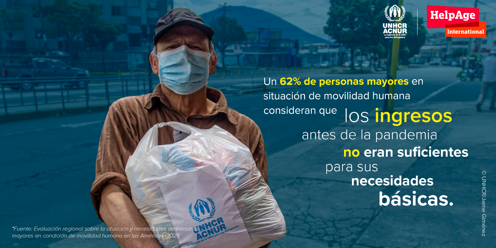
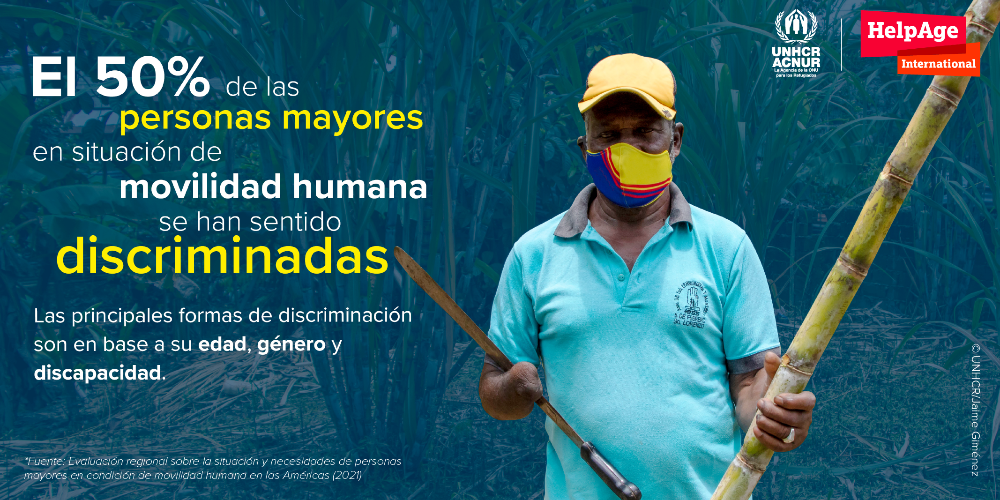
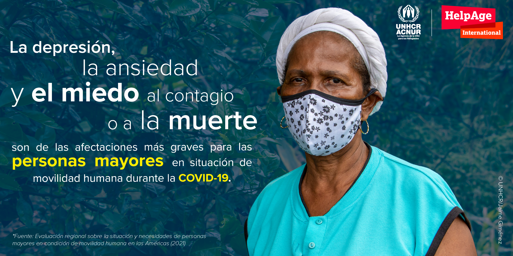
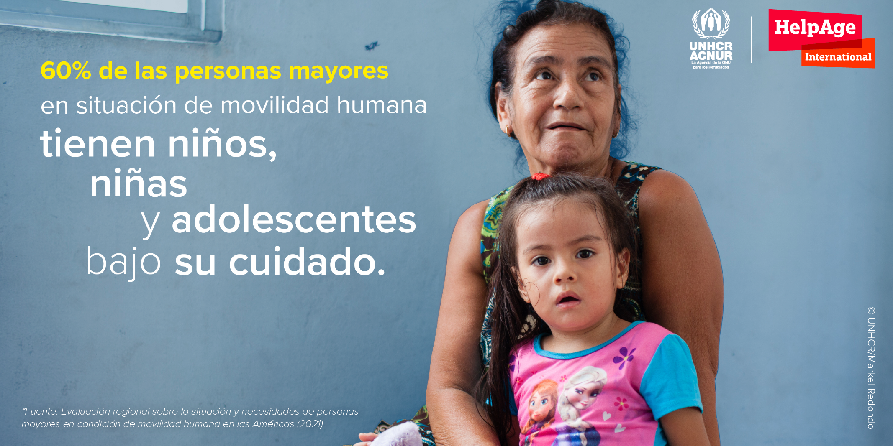

<script type="text/javascript" src="//platform.twitter.com/widgets.js"></script>

<script src="//ajax.googleapis.com/ajax/libs/jquery/1.10.2/jquery.min.js"></script>
<script type='text/javascript'>
$(document).ready(function() {
  $('.tweetable').each(function() {
     var sentence = $(this);
     var permalink = sentence.parents('.post-outer').find('.timestamp-link').attr('href') || $(location).attr('href');
     var tweetable = sentence.text();
     var result = encodeURIComponent(tweetable);
     var link = encodeURIComponent(permalink);
     
sentence.wrap('<a class="tweet-link" href="https://twitter.com/intent/tweet?text=' + result + " " + link +'"></a>');
    });
});
</script>


```{r setup, include=FALSE}
knitr::opts_chunk$set(echo = FALSE)

# Learn more about creating websites with Distill at:
# https://rstudio.github.io/distill/website.html

# Learn more about publishing to GitHub Pages at:
# https://rstudio.github.io/distill/publish_website.html#github-pages

library(knitr)
```


## A need for specific care

More than half of the older people surveyed required support in their daily activities or daily needs (54%), an average that increases by more than ten points for persons with disabilities (66%). Support is mainly provided by family members (62%), but also by other people, such as children living at home, friends and family members (62%). It is a matter of concern that 12% of older people did not receive support although they required it, which may be related to the fact that 11% of older people live alone. 

<aside>
 This report is the first regional evaluation that makes an in-depth analysis of the intersectionality between old age and human mobility.
</aside> 

The International Humanitarian System, Agencies and Donors are called upon to better __include older persons in situations of human mobility as a priority and vulnerable group__ in all their agendas, adapting and financing the institutional structure that responds to their needs. This should be translated into humanitarian responses and programmes that include older persons in human mobility as direct beneficiaries, guaranteeing their dignity, autonomy, independence and participation, avoiding interventions that expose them to situations of dependency, abuse and discrimination. Humanitarian aid should include physical and mental health care, and housing or shelter support, given the general impacts and risks that evictions can generate. Support for work or entrepreneurship should also be considered.
 
<aside> 
The information gathering was carried out through 725 surveys of elderly people in situations of human mobility, 62 surveys of service providers, and 78 in-depth interviews with older people, caregivers and key actors in five countries: Colombia, Ecuador, Peru, Honduras and El Salvador.
</aside>   

Globally, States are called upon to push forward the project to draft and adopt a United Nations International Convention on the Protection of Older Persons, led by the [Open-Ended Working Group on Ageing](https://social.un.org/ageing-working-group/). Regionally, it is important for States to adhere to and implement the [Inter-American Convention on Protecting the Human Rights of Older Persons (IACPHROP)](http://www.oas.org/en/sla/dil/inter_american_treaties_a-70_human_rights_older_persons.asp), as the legal framework in force for all American States, adapting their domestic laws in the light of this instrument and other relevant International and Regional Human Rights Law protection frameworks. To this end, ten States must complete their accession to the IACPHROP in order to activate the monitoring mechanism foreseen to promote effective compliance. 

The IACPHROP is a reference for governments to design progressive public policies that lead to a new way of considering old age and ageing from different paradigms, reaffirming the condition of older people as subjects of rights, with full capacity, autonomy and independence to make decisions that affect or involve their life project. All older persons in situation of human mobility must be guaranteed their right: 
  *  to equality and non-discrimination (Art. 5); 
  *  to freedom of movement and to choose their residence (Art. 15); 
  *  to guarantee their integrity and rights in humanitarian situations (Art. 29);  
  *  to physical and mental health free of discrimination of any kind (Art. 19); 
  *  to decent and dignified work (Art. 18); 
  *  to a comprehensive system of care (Art. 12), 
  *  to decent and adequate housing and to live in safe environments (Art. 24); 
  *  to safety and freedom from violence, to be treated with dignity and to be respected (Art. 9); 
  *  to active, productive, full and effective participation in the family, community and society (Art. 8); 
  *  to freedom of expression and opinion (Art. 14), among other rights. 


 

## What are the profiles and condition of ageing people forced to move?

### Main reasons

Among the countries included in the assessment, in Guatemala, El Salvador & Honduras , human mobility is mainly characterized by internal displacement flows resulting from gang or mara violence, people deported mainly from the United States and Mexico, and the socio-economic difficulties caused by COVID-19. The three main causes of human mobility identified  are:

* access to work or income opportunities (47% overall), with a significant gender difference of 53% for men and 39% for women, the causes of which affect principally deportees (70%)
* The need for protection from threats, violence or persecution (28% overall), and is the main cause of mobility for 36% of IDPs.
* Supporting the family (25% overall), is the third main cause reported by 47% of deportees. 

These three main causes .
In the Andean region, mixed movements (refugees and migrants) are mainly observed as a result of the humanitarian crisis in Venezuela, which has led to the exodus of millions of people. In this second context, the main cause of human mobility is access to food (76%), reaching 84% in the refugee and migrant population and with a gender difference of almost 10 points: 71% men vs 80% women. The second main cause is a lack of access to health (73%), with a 12 point difference among persons with disabilities, whereby 80% lack access compared to 68% of those without disabilities. Here too, there is a marked difference between men (66%) and women (79%). The third cause is access to work or income opportunities (58%), with a difference of almost ten points between men (63%) and women (54%), and with a difference between persons with disabilities (52%) and those without (62%).
In 89% of the cases, these reasons for human mobility affected not only the older person but also his or her family group, making family reunification a fourth cause. 

### Accessibility 
On average, 29% of older people surveyed did not use health services when they needed them before the pandemic. The limitation in access to health services in the northern Central American countries is 24%, in contrast to the Andean countries, which average 32%.
The main causes of lack of access are common to all countries: lack of money (21%), lack of health coverage (19%), lack of documentation (7%), lack of knowledge of services (5%), difficulties in getting around (2%), distance from health centres (1%). The rest of the percentage corresponds to other causes, such as difficulties in attending the medical centre, not having someone to accompany them or not prioritising the need for care. 
More than a fifth (21%) of those who used health services have had to pay, which, given the severe financial condition that most older people in situations of human mobility are subject to, severely limits their ability to access the services they need.


### Economic security


```{r, layout="l-screen"}

```
 
Around 64% of older people surveyed had no monthly income before the pandemic, and of those who had an income, 62% felt it was not enough to meet their basic needs. 
In the northern Central American countries, 57% of older people in situation of human mobility had no monthly income, and 71% felt that their income was not sufficient to meet their basic needs. 
In the Andean region, two-thirds (66%) of older people in a situation of human mobility had no monthly income, and 57% considered that their income was not sufficient to meet their basic needs, a figure that reaches 70% in Colombia. 
 
Around 52% of the respondents had a job before the pandemic, with a marked difference between men (63%) and women (41%). Older people in human mobility who have a disability status and were unemployed account for 58%, with an unfavourable difference between older women (70%) with a disability and older men (43%) in the same situation. Of the total number of older persons surveyed who had a job, 79% were in informal employment, 15% in formal employment, and 6% worked in family entrepreneurships. 
Caregiving tasks 
Thirty-seven per cent of the sample had older dependents before the pandemic, with a striking difference of 15 points between men (45%) and women (30%). This may be related to the fact that men consider financial support as part of caregiving actions. 
In the flows of the countries of northern Central America, the percentage of caregivers reaches half of the population (49%), and in the countries of the Andean region it reaches one third (32%).
On average, children and adolescents (60%) constitute the main population group under the care of the older people surveyed, followed by adults aged 18-59 (38%), people over 60 (20%) and persons with disabilities (5%). There is a noticeable difference in caring for adults in general, with 71% of male carers and 44% of female carers.

### Pension system
In the northern Central American countries, only 10% received a social pension while 5% reported receiving other pensions, including veteran's and disability pensions. There is a difference in the reception of social pensions among persons with disabilities, with 18% compared to 3% for those without disabilities. There is also a noticeable gender difference, with 14% of men receiving a pension compared to 4% of women.  
In northern Central America, many deportees report that they had been contributing for years in the country of destination (informal systems), but that they lost these savings when they were deported.
In the Andean region, very few people receive pensions. Only 4% receive social pensions, mostly in the case of IDPs and returnees in Colombia, who are affiliated to the social security system to a greater extent than in the rest of the countries (56%).
Food security 
Of the older people surveyed in the five countries, 74% had access to three meals a day before the pandemic, 19% had access to only two meals, 2% had access to only one meal, and 2% sometimes had no meals at all. 
Although the average number of meals per day is high, this does not imply that older people can enjoy an adequate nutritional balance for older people, as in many cases food consumption is mainly composed of carbohydrates, especially in rural areas of northern Central American countries, with little protein or no ingredients suitable for older people's diets. 
Access to food is provided mainly through the support of family members and their own income, or to a greater extent through the support of neighbours or friends. 

### Housing and accommodation
On average, 61% of the older people surveyed live in rented accommodation and only 20% have their own flat or house. Women seem to have less housing security than men. Some 66% of women live in rented accommodation, almost 10 points higher than men, at 57%, and only 17% live in their own home compared to 24% of men.
In the countries of northern Central America, 44% of people live in a flat or house of their own, a marked contrast to the countries of the Andean region, where only 9% of people live in a flat or house of their own. In northern Central America, the average number of people living in rented accommodation (32%) is much lower than in the Andean countries (79%), where mixed movements reach an average of 85%. 
More than a third of the population lives in a single room (36%) and half of the population shares a room with one or two other people (51%); overcrowding was reported to a lesser extent, with three or more people sharing a room (13%). Overcrowding is a matter of concern for the internally displaced population in Honduras, which reaches a third of the population (34%), and for refugees or refugee status seekers in Colombia, which exceeds half of the population (57%), as well as for migrants in Colombia, which exceeds a fifth of the population (22%). These figures are similar those relating to refugees or refugee status seekers in Peru (20%).

### Difficulties in access
The first difficulty in obtaining housing is related to a lack of financial resources (41%). On average, 48% of older persons with disabilities in the sample had difficulties given their lack of resources, compared to 36% of those without disabilities. Secondly, they experience rejection for finding themselves in situations of human mobility (23%). This affects a third of the sample who are in a situation of forced internal displacement in Honduras and Colombia. In Honduras, this rejection mostly affects persons with disabilities (15%) compared to those without disabilities (3%). 

Services and housing conditions 
In general terms, the households of older persons in human mobility have 24-hour electricity (97%), drinking water (91%) and a bathroom (87%); however, almost a third of the sample does not have sewerage (31%) and a third does not have a gas service. Sixty-one per cent of the older people surveyed do not have internet connectivity in their homes and only 11 per cent have landline telephone connections.  

## What are the specific protection risk they are exposed to?  

### Abuse and non-discrimination
The overall rate of elder abuse surveyed in the countries under study before the pandemic is 38%, with a marked difference between those with disabilities (48%) and those without (29%). During the pandemic, averages of abuse do not seem to be subject to significant fluctuations; however, only a quarter of people attend medical facilities following abuse and 23% report abuse, leaving a large percentage of people unprotected in this respect.
In the northern Central American countries, the percentage of elder abuse is 63%, with a significant difference between persons with disabilities (87%) compared to those without disabilities (40%). The gender difference is 11 points, with 65% for men compared to 57% for women. In the Andean region, mistreatment is lower, affecting a quarter of the population (26%), and there is a gender difference of 34% for women compared to 20% for men.
In terms of the older persons with disabilities surveyed in northern Central America, the most recurrent forms of abuse are psychological abuse (36%) and eviction (14%), with slightly more men than women, 3% and 7% respectively. 
The most commonly occurring type of abuse against older persons with disabilities in the countries of the Andean region is eviction (8%), affecting more women than men in this situation, by three percentage points. 
Among the perpetrators of abuse, 11% were family members; 7% were government officials, including the security forces; 7% were friends or neighbours; and 74% were other people, for example, armed actors, gangs, people on the street, on public transport, or the owners of the homes which they rented or where they lived.

### Safety

Around 36% of older persons surveyed and living in northern Central America consider the place where they live to be unsafe, because of internal violence by gangs. A third of deportees in the same region (33%) did not feel safe to return to their place of origin, mainly because of threats, violence, or persecution. 
For people in transit between countries who cross borders on a daily basis, the risks are worrying. The "trochas" or "green roads" are irregular border crossings that are extremely dangerous for those who are forced to cross them, as they expose themselves to robbery, rape, kidnapping and human trafficking, among other risks. 

### Discrimination


```{r, layout="l-screen"}

```

Fifty per cent of older persons in situation of human mobility have felt discriminated against. The main form of discrimination is age, with an average of 25%; however, there is a difference of more than 10 points between women (30%) and men (19%), with the latter feeling greater levels of discrimination. Another notable gender difference is discrimination on the basis of disability, where 5% of women report feeling discriminated against, compared to 10% of men. 
In the northern Central American countries, age discrimination reaches 27%, which is more noticeable among deportees in both Honduras and El Salvador. Similarly, both countries report discrimination based on the condition of human mobility among deportees and displaced persons. In the countries of the Andean region, age discrimination reaches the same percentage as discrimination based on human mobility status at 25%.
Participation, information and empowerment  
More than two thirds of the sample had no activities to share or to socialise with others, with this average being even higher for some flows such as the mixed movements in the Andean region. Women presented a higher percentage of non-participation than men, with 71% compared to 67%. In situations of disability, 70% stated that they did not have any participation opportunities or activities. 


### COVID-19: impacts 


```{r, layout="l-screen"}

```

Impacts
All countries have been experiencing job and income losses during the pandemic. The percentage of older persons who had jobs and either lost or suffered a decrease is notable in all countries. In the northern Central American countries, the decrease amounts to 52% and job loss to 33%; the rest have maintained or increased their employment. In the countries of the Andean region, work has been reduced for 44% of the surveyed population, while 49% have lost their jobs. 
In northern Central America, in general, income reduction affects 67% of the population while income loss affects 11%. In the countries of the Andean region, the percentage decline affects half of the population (49%), the decline in mixed movements exceeds 50% and the loss of income among this group of people affects more than a third of the total older population (36%).
Psychological effects such as depression, anxiety and permanent fear of contagion or death are another major problem. Emotional illnesses and disorders, which were already at an advanced stage of requiring psychological treatment, especially in older people who are victims of internal displacement and deportation, have been intensified by the pandemic.
Isolation or "confinement" or "not being able to leave the house" as it is referred to, is one of the most important effects, as people cannot meet with friends and family as they normally would, and their recreation is also reduced. The pandemic has led to a decrease in the daily contact of older people in human mobility with their families, from 39% to 26%, which has an impact on feelings of isolation and loneliness, which, in turn, aggravates physical and mental health conditions. 
Overall, limitation in accessing health services to treat symptoms or illnesses other than those associated with the virus is increasing, reaching 43% in northern Central America and 44% in the Andean region. The limitation is even greater for persons with disabilities, involving half of the sample (50%). 
Six per cent of people indicated that they were discriminated against in accessing medical services just because they were suspected of having COVID-19 because of their age. In addition, 12% of the total sample was infected, of which 6% did not receive adequate treatment. Ninety-eight percent of the sample indicated that they have access to biosafety items and 70 per cent purchase them. The pandemic has also created difficulties in managing documentation by reducing people’s possibility of traveling to the offices where procedures are carried out or by making it difficult to access online procedures.
During the pandemic, the housing conditions of 20% have deteriorated or been lost, mainly due to a lack of economic resources, making it difficult to pay rent. Eviction is identified as one of the most serious risk situations faced by older persons in situation of in human mobility, reaching an average of 5% of the sample during the pandemic; however, the most worrying aspect is that 89% of the people do not know about the protection measures that exist against eviction. 
Older persons’ participation has been further diminished by the confinement resulting from the pandemic. There are many cases of isolated older personsople who have no community involvement or opportunities for recreation, which is having negative effects on their mental and physical health.   
There is evidence showing that during the pandemic, difficulties in access to food for older persons have worsened in all countries, and 41% have decreased their food consumption. 

## What challenges are being faced?

### Holding Documentation 

```{r, layout="l-screen"}
include_graphics("images/SPA_WIDE_MACRO 5.png")
```

In the countries of Guatemala, El Salvador & Honduras, most of the older people interviewed hold identity documents from their own country, which should enable them to access different rights and services. In the Andean region, almost a quarter (24%) of older refugees, migrants or asylum-seekers have no documentation, and this figure rises to 32% among persons with disabilities, compared to 18% of those without, revealing a double vulnerability. There is also a gender difference, with 27% of women having no documentation at all, compared to 19% of men. In this region, despite the fact that those in need of international protection is high, the percentage of those with refugee status is very low, reaching only 9% of the total sample. Many Venezuelans, for various reasons, opt for other types of regularization in host countries.
In all countries there are older people who are unable to complete their regularization procedures and get their documents, either because they are alone (11% of all people live alone) or because of distance or lack of accessibility (67% of the older population indicate that they have difficulties in accessing and traveling on public transport). 

### Lacking information  

The lack of information on the procedures required to obtain a document to remain in the host country legally is a problem that especially affects older refugees and migrants in the countries of the Andean region; a third of the sample (32%) have not had access to regularization process or asylum procedures due to lack of information. Among those who have not yet accessed the asylum procedures, it is women (30%) who have shown the greatest problem with regard to lack of information compared to men (19%).

### Accessing Humanitarian aid 

Thirty-six percent of older respondents from Guatemala, El Salvador & Honduras reported receiving humanitarian aid, compared to 49% of those from the Andean region. 
The main gender difference in humanitarian aid is found among refugees or asylum seekers in the different countries, where 60% of older men have received humanitarian aid compared to 40% of women. The difference among older persons with disabilities who have received aid is 8% less than those without disabilities. 
Older IDPs in the Guatemala, El Salvador & Hondurasn countries have received 54% assistance compared to 82% in the case of IDPs in Colombia, with no noticeable differences in gender or disability.
In the case of persons part of mixed movements in the Andean region, 45% of this population has received humanitarian aid. Older returnees to Colombia with disabilities present a lower percentage of receiving humanitarian aid (18%), compared to those without disabilities (31%).
In all countries, aid mainly involves food and toiletries, with 48% in the Guatemala, El Salvador & Hondurasn countries and 52% in the Andean countries. In second place, subsidies, economic support or cash transfers stand out, with 35% in the countries of northern Central America and 45% in the Andean region. 
Access to psychosocial support or counselling is higher in the northern Central American countries, reaching almost a third of the sample (27%). Deportees in Honduras account for only 2%. In the countries of the Andean region, the figures are very low or they present a large gap, as is the case for Colombia. 
There are limitations in legal aid for some flows, creating an urgent need for accompaniment, especially for older people who lack documentation or who have to apply for state benefits. Colombia is one of the countries where the percentage of legal aid is significant, as it reaches 50% of the refugee population or asylum-seekers, making it the country with the highest coverage.
Another concerning issue is the lack of access to health services in the countries of northern Central America, as well as in Colombia. In general, in the rest of the population groups in situation of human mobility, access remains very limited. 

### Benefiting from Health and care


```{r, layout="l-screen"}

```

The three main health problems in older people extracted from the sample, and considering the flows studied, are hypertension, with 42% of the total; mental health problems (34%); and gastrointestinal problems (21%). This is followed by heart problems (16%), diabetes (15%), respiratory problems (14%) and cancer (4%). The biggest difference is in the average number of those with mental health problems in northern Central America, at 47%, compared to 22% in the Andean countries. In Honduras, 50% of the older IDPs in the sample have a mental health condition. In El Salvador, the average is equally high for older IDPs at 55%, and older deportees surveyed at 62%. In the Andean region, a high percentage is found among older migrants surveyed in Ecuador with 43%.

Forty-two percent of older people surveyed in all countries have not received treatment to address different health conditions, with a slight difference in the lack of access to treatment between men (46%) and women (38%). 

### Access to equipment and level of connectivity
Most older persons own mobile phones (87%), followed by television (70%) and radio (35%). Only 10% have access to landline phones, laptops, entertainment devices, tablets and desktop computers. In general, older persons’ mobile phones are not smartphones, and several use their relatives' mobile phones to communicate and connect to the Internet. One of their main uses for mobile phones is to connect with family members via WhatsApp.  
Average Internet access is slightly above one third of the sample, with the exception of the mixed movements in Colombia and Ecuador, where it exceeds half of the population (57%). Eighty-four percent of older persons have not attended talks or participated in training and awareness-raising activities concerning their rights. Only 7% have received training on rights as a person in situations of human mobility, 6% on their rights as older persons, and 7% on how to become productive through work or entrepreneurship. 
Older persons and their families in situations of human mobility are faced with the fact that access to information on regularisation processes is difficult, due to the lack of prioritisation and targeting by those in charge of providing advice. It is also representative of the level of misinformation among older persons to recognise the institutions in charge of each case, as many of them live alone, compared to those whose family members are the main or only source of information. 


## Conclusions


<p class="tweetable">Irregularity or lack of access to asylum facilities can lead to a series of risks and difficulties in the enjoyment of rights by older persons in human mobility.</p>

  *  	 This was mainstreamed in the results that were analysed in terms of access to health, housing, work and security, among other rights. In the Andean region, there are high percentages of older persons who have no documentation, mainly in mixed movements, with greater difficulties in terms of gender and disability differences.

In this respect, the main difficulties for obtaining documentation are, on the one hand, the high degree of misinformation on administrative procedures required to remain in the countries legally and, on the other, the absence of a priority approach to provide documentation by the respective authorities. 

  *  	There is evidence showing the lack of a humanitarian aid system with a priority focus that responds to the needs of older people in human mobility. Older refugees or asylum seekers in the Andean countries constitute the flow with the greatest difficulty in accessing humanitarian aid, especially for older women. 
  

<p class="tweetable">In northern Central American countries, older deportees are reported to be the most neglected in this respect.</p>
 

  *  	Older persons have a number of health problems that tend to receive little attention. Mental health is the second most prevalent condition after hypertension, and is directly linked to human mobility in all countries. This is a condition that requires urgent attention. A high percentage of people need to be provided with in this respect; however, there is a significant percentage who do not have this support and who live alone while dealing with helplessness and vulnerability.

  *  	The vast majority of the older people in human mobility surveyed live in a situation of great economic vulnerability, since very few or no pensions are received, and access to work is limited by the conditions of the labour markets, by the lack of documentation and by discrimination mainly due to age and mobility. All this leads to informality in situations of precariousness and labour exploitation, with long working hours and low incomes, as well as degrading and dangerous situations. Precarious conditions are exacerbated in rural areas, especially for groups of people who may face forced displacement.

  *  	There is a high percentage of caregivers: 45% of older men and 30% of older women. This 15-point difference may be due to the fact that older male respondents consider the financial support they provide as part of caregiving. 

  *  	There is a sector of the older population that is not being adequately nourished, with more than a fifth not eating three meals a day, compounded by a decrease in meal consumption as a result of the pandemic. Older people's diets are not nutritionally balanced, and this needs to be addressed in order to provide guidance and resources to people to improve their diets, control overweight, and prevent tan increase of chronic diseases.

  *  	The older population in situation of human mobility is subject to poor security in terms of the right to housing. There are cases of overcrowding in Honduras, Colombia, and Peru. Eviction is another serious risk for older people and is a form of mistreatment of this population group as well as their families. Also of concern is the high percentage of people who are unaware of their rights in relation to this phenomenon. The main causes of difficulty in finding housing are a lack of economic resources and rejection on account of their status as persons in situation of human mobility. This is especially true in the countries of the Andean region and may be related to xenophobia. As a form of mistreatment, this affects one fifth of the population.

  *  	Psychological abuse is a problem that should be prioritised, as it is linked to insecurity and violence, especially in the countries of northern Central America. In this sense, older people in human mobility are more vulnerable than the rest of the population. Women suffer higher percentages of psychological abuse in several cases, and it is necessary to consider gender differences in terms of the forms of mistreatment. People in transit may be at very high risk due to the extreme vulnerability that crossing irregular border crossings sometimes entails.

  *  	In addition to being the main form of discrimination, age discrimination has negative effects in all areas of the effective enjoyment of rights. Discrimination based on the very condition of being a person in situation of human mobility is also a cross-cutting barrier to accessing services and rights, requiring a major awareness-raising effort in the host communities. The fact that older persons are less likely to participate must be addressed and reversed in order to improve their well-being and quality of life. There is an inverse or negative correlation between discrimination and participation: the more people feel discriminated against, the lower their level of participation. 

  *  	Internet access is still low, despite the fact that a high percentage of older people have access to a mobile phone. Older people's handling of mobile devices is still basic and it is important to improve the connectivity and digital literacy. People need to be empowered by taking more courses, participating in groups or increasing knowledge of their rights as older people in situations of human mobility as the percentages in this respect are very low.


 


