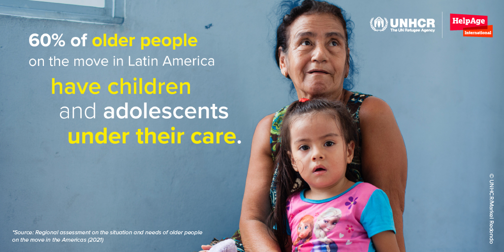
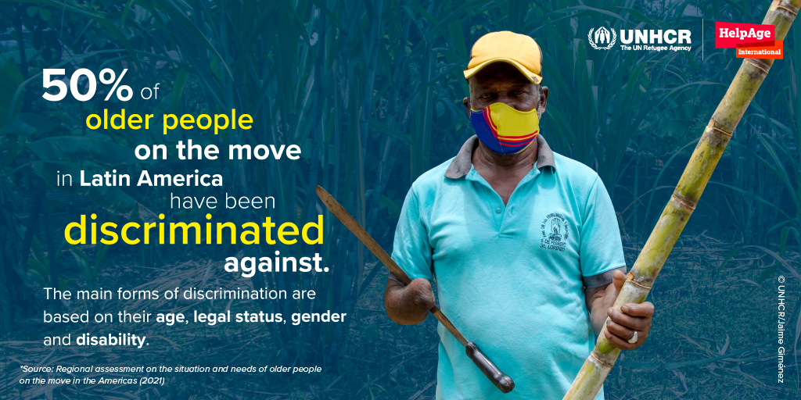
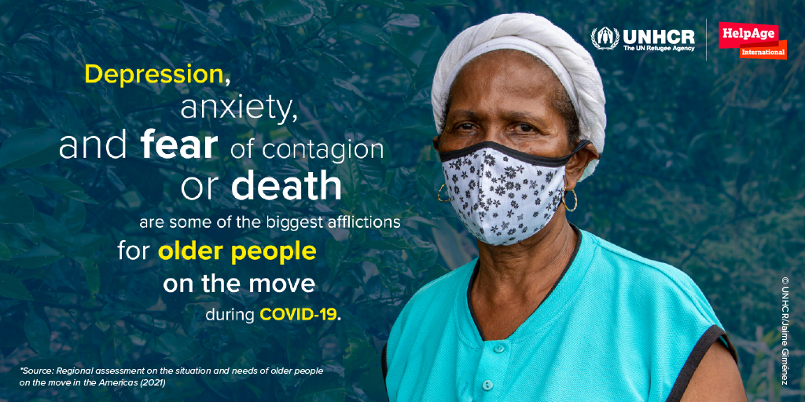

<link rel="shortcut icon" href="images/favicon.ico" type="image/x-icon">
<script type="text/javascript" src="//platform.twitter.com/widgets.js"></script>

<script src="//ajax.googleapis.com/ajax/libs/jquery/1.10.2/jquery.min.js"></script>
<script type='text/javascript'>
$(document).ready(function() {
  $('.tweetable').each(function() {
     var sentence = $(this);
     var permalink = sentence.parents('.post-outer').find('.timestamp-link').attr('href') || $(location).attr('href');
     var tweetable = sentence.text();
     var result = encodeURIComponent(tweetable);
     var link = encodeURIComponent(permalink);
     
sentence.wrap('<a class="tweet-link" href="https://twitter.com/intent/tweet?text=' + result + " " + link +'"></a>');
    });
});
</script>


```{r setup, include=FALSE}
knitr::opts_chunk$set(echo = FALSE)

# Learn more about creating websites with Distill at:
# https://rstudio.github.io/distill/website.html

# Learn more about publishing to GitHub Pages at:
# https://rstudio.github.io/distill/publish_website.html#github-pages

library(knitr)

library(metathis)

meta() %>%
  meta_social(
    title = "A dignity claim: Ageing on the move",
    description = "Making ageing persons visible to enhance comprehensive actions in humanitarian responses",
    url = "https://ageingonthemove.org",
    image = "https://raw.githubusercontent.com/unhcr-americas/ageingonthemove/main/images/macro/ENG-MACRO-1.jpg",
    image_alt = "A dignity claim: Ageing on the move",
    og_type = "website",
    og_author = "UNHCR",
    twitter_card_type = "summary",
    twitter_creator = "@unhcr"
  )

```


## Introduction  

There is little information on the situation of older persons on the move in the Latin American region. This regional evaluation is the first one to make a comprehensive analysis on the intersectionality between ageing and human mobility. The current situation of the COVID-19 pandemic is also analysed, including the worsening access to rights and services and the impact in their lives.  

The assessment focuses in __five countries in the region: El Salvador, Honduras, Colombia, Ecuador and Peru__. Different data is provided on Central America and the Andean regions, highlighting the situations faced by older persons on the move in these two different contexts. 

El Salvador and Honduras are mainly characterised by internal displacement flows resulting from gang or mara violence, returns and the socio-economic difficulties caused by the pandemic. While Colombia, Ecuador and Peru are mainly characterized by mixed movements (refugees and migrants) as a result of the ongoing political, human rights and socio-economic crisis in Venezuela, which has led to the exodus of millions of people. 

<aside>A total of 725 older persons were consulted via telephone, as well as caretakers, service providers and key actors with in-depth and semi-structured interviews and online surveys. </aside>

Although both context present different challenges, older persons on the move face similar limitations in accessing their rights and services. 


With this report, UNHCR and HelpAge aim to cast light on the challenges and risks faced by older persons on the move so that actions are taken to ensure they are not left behind.


## Call to Action

The international community is called upon to include older persons on the move as a priority group in all their agendas, adapting and financing the institutional structure that responds to their needs. This should be translated into humanitarian responses and programmes that include older persons on the move as direct beneficiaries, guaranteeing their dignity, autonomy, independence and participation, avoiding interventions that expose them to situations of dependency, abuse and discrimination. 

 1.  Older persons in forced displacement have long encountered insufficient protection and neglect. Their full __inclusion in national responses__ to the pandemic is key in order to safeguard their dignity and rights. 

 2.  Besides increased humanitarian support, older displaced persons need greater __livelihoods opportunities__, to become financially independent.

 3.  It is necessary to implement mechanisms for participation, consultation and feedback in the design, planning and implementation of humanitarian responses, so that the __voices of older persons on the move are heard__, and their life experience and resilience are recognised as added values in such responses.

 4.  Globally, States are called upon to push forward the project to draft and adopt a United Nations International Convention on the Protection of Older Persons, led by the [Open-Ended Working Group on Ageing](https://social.un.org/ageing-working-group/).  Regionally, it is important that States in the Americas  adhere to and implement the  [Inter-American Convention on Protecting the Human Rights of Older Persons](http://www.oas.org/en/sla/dil/inter_american_treaties_a-70_human_rights_older_persons.asp), as the __legal framework__ in force for all American States, adapting their domestic laws in the light of this instrument and other relevant International and Regional Human Rights Law protection frameworks. 


<div class="parallax parallax1"><div class="parallax-content">
## What are the protection risks and challenges faced by older persons on the move in the Americas?
</div></div>


### Living for months without documents and information 

Older persons consulted mentioned to be unable to complete their regularization procedures and get their documents, either because they are alone (11% of all people live alone) or because of distance or lack of accessibility (67% of the older population say that they have difficulties in accessing and travelling on public transport).

<aside>The lack of information regarding the regularization procedures is a specific challenge reported in the Andean region.</aside> 


Older persons on the move in the Andean region are the most affected by lack of documentation: 24% of all interviewed did not have any documentation. 

This figure worsens among persons with disabilities, which increases their vulnerability. Here also a gender difference is found: 27% of women having no documentation at all, compared to 19% of men. In this region, even though the percentage of those in need of international protection is high, the percentage of those with refugee status is low, reaching only 9% among respondent. Many Venezuelans, for several reasons, opt for other types of regularization in host countries.

>  “We requested an appointment for our asylum claim and we got scheduled for 2022”.
>  -- Woman (67) in Peru, 2020  

### Many have limited access to health care 


 42% of respondents are not receiving treatment for different health conditions either due to missed medical appointments, lack of documentation, lack of money to pay for medicine or fear of approaching health centres due to the risk of contagion. Difficulties in getting around or distance from health centres are only rarely given as reasons.

<aside>On average, around 30% of older people consulted did not use health services even when they were needing them before the pandemic.</aside>

More than a fifth of those who used health services have had to pay, which, given the severe financial condition that most older persons on the move are subject to, severely limits their ability to access the services they need.

Most of the older persons consulted reported limited access to health care during the pandemic. Forty-two per cent were not receiving treatment for prior health conditions and 6% of those infected with COVID-19 reported not receiving adequate medical care. 

Almost 27% of the people interviewed reported not having access to any health service, and 98% reported having at least one health condition or disability.

### Facing job losses and lack of income 

Older refugees have been deprived of their financial autonomy as many have lost their jobs and source of income and been left dependent on the often inexistant humanitarian aid. 

Some 64% of older persons consulted had no monthly income before the pandemic, and of those who did have an income, 62% felt it had not been enough to meet their basic needs.

Despite their increased vulnerability, older persons on the move have often become the main bread-winners for the household as they continue to have family members under their care, including children and adolescents (60%), adults (38%), people over 60 years old (20%) and persons with disabilities (5%)
 
```{r, layout="l-page"}

```


### A quarter of older persons consulted are not eating 3 meals a day. 

Access to food for older persons on the move has worsened in all countries assessed. Already prior to the pandemic, one in four were having to skip meals. With the advent of COVID-19, 41% had to further reduce their food intake. 
Even for those who eat sufficient number of meals per day, it does not imply that they enjoy an adequate nutritional balance, as in many cases food consumption is mainly composed of carbohydrates, especially in rural areas of Honduras and El Salvador, with little protein or no ingredients suitable for older people's diets.  

Access to food is provided mainly through the support of family members and their own income, or to a greater extent through the support of neighbours or friends.


> “Sometimes we don’t eat breakfast, we only have one meal a day”
> – Agapito 
  


### Poor housing impacts the lives of older people   

On average, 61% of the older persons consulted live in rented accommodation and only 20% have their own flat or house. Women seem to have less housing security than men. Some 66% of women live in rented accommodation, almost 10 points higher than men, and only 17% live in their own home compared to 24% of men. 

<aside>During the pandemic, one fifth of those interviewed were unable to afford rent and five per cent had been evicted.</aside>

In Honduras and El Salvador, 44% of people live in a flat or house of their own, a marked contrast to the countries in the Andean region, where only 9% of people live in a flat or house of their own. In Honduras and El Salvador, the average number of people living in rented accommodation (32%) is much lower than in the Andean countries (79%).  

A third of the surveyed population lives in a single room and half of the population shares a room with one or two other people. Overcrowding is a matter of concern for the internally displaced population in Honduras, which reaches a third of the population, and for refugees and asylum-seekers in Colombia, which exceeds half of the population. These figures are similar to those relating to refugees or asylum-seekers in Peru.

 


### Older persons on the move have limited access to humanitarian aid

Less than half of the older persons consulted reported receiving humanitarian aid (36% in northern Central America and 49% in the Andean region). 

In all countries, aid mainly involves food and toiletries, with 48% in Honduras and El Salvador and 52% in the Andean countries. In second place, subsidies, economic support or cash transfers stand out, with 35% in Honduras and El Salvador and 45% in the Andean region.

While in the Andean region, half of respondents reported receiving humanitarian aid, in Honduras and El Salvador, this was the case of only a third of respondents. 


<div class="parallax parallax2"><div class="parallax-content">
## Older persons want independence & autonomy
</div></div>


### Discriminated by their age   

Half of the older persons on the move consulted described having experienced discrimination while a worrying number described incidents of abuse. 
More than a third of the respondents reported being abused in the countries where they reside and before the pandemic with a marked difference between those with disabilities (48%) and those without (29%).  

<aside>In Honduras and El Salvador, 63% of respondent reported being victims of abuse, a proportion increased to 87% for persons with disabilities.</aside> 

In the Andean region, mistreatment is lower, affecting a quarter of the population (26%), and there is a gender difference of 34% for women compared to 20% for men.

The most commonly occurring type of abuse against older persons with disabilities in the countries of the Andean region is eviction (8%), affecting more women than men in this situation, by three percentage points.  

Among the perpetrators of abuse, 11% were family members; 7% were government officials, including the security forces; 7% were friends or neighbours; and 74% were other people, for example, armed actors, gangs, people on the street, on public transport, or the owners of the homes which they rented or where they lived.

 
```{r, layout="l-page"}

```

### Active participation in their communities  

The empowerment of the older persons is related to factors such as participation, physical accessibility, the ability to move from one place to another as well as the communication channels at their disposal that generate autonomy and independence. 

<p class="tweetable">More than two third of ageing person on the move had no activities to share or to socialize with others. </p>
 
Women presented a higher percentage of non-participation than men. This participation is even lower when it comes to older persons with disabilities. In addition, around 84% of older persons have not attended talks or taken part in training and awareness-raising activities concerning their rights.  
Although before COVID-19 the older persons did not actively participate, during the pandemic, their participation has drastically decreased due to the confinement measures, which has caused physical and mental health problems.

### Using the right communication channel  

Equipment and Internet access are essential supports in the information process, but also as mechanisms for participation in virtual activities or as intermediaries to facilitate the development of community actions.
More than 85% of older persons have access to mobile phones, 70% to a television and only 35% to a radio. Though only 10% have access to landline phones, laptops, entertainment devices, tablets and desktop computers. 
Access to mobile phones does not necessarily imply Internet connectivity, since on average access slightly exceeds one third of the population, except for Colombia and Ecuador. In addition, most of their mobile phones are not smartphones. One of their main uses is to connect with family members via WhatsApp.    


<div class="story">

<p>STORY: Older Colombians and Venezuelans take care of each other under the same roof</p>
<p>
  Born on 3 October 1989, in Riohacha, La Guajira, northern Colombia, this was the life project of a social worker and her family, with the idea of supporting and helping older persons in this area of the country. They have been at the service of those in need of their assistance for 33 years -people who have been abandoned by family members and who are sheltered there. This is a community-based effort.  
</p><p>
  Initially, Fundación Casa del Abuelo was seen as a place for recreation and entertainment for older persons passing through. But over time and given the extreme needs in the territory, it was transformed to provide 24/7 assistance. 
</p><p>
  Grandpa’s House hosts Colombian seniors who were left alone. Now it has increased its capacity to also shelter Venezuelans on the move. 
</p><p>
  “We were witnessing this sudden and massive influx of Venezuelan people: families with children living on the streets and begging for a roof, a soup or for a few pesos,” explains Maria Peña De Melo, the director of the centre. “We decided we had to do something for them as well.” 
</p><p>
  “Many things changed since we started to host the families and their kids”, Maria adds. “The seniors see them as members of their families. They feel more ‘protected,’ as they perform some activities together every day. This strengthened the confidence of the abuelitos [grandparents] a lot.” 
[read the full story here](https://www.unhcr.org/news/stories/2019/6/5cffc16c4/older-colombians-venezuelans-care-other-under-roof.html).
</p>

<iframe width="560" height="315" src="https://www.youtube.com/embed/Ehf67tMy-0c" title="YouTube video player" frameborder="0" allow="accelerometer; autoplay; clipboard-write; encrypted-media; gyroscope; picture-in-picture" allowfullscreen></iframe>
</div>


  

<div class="parallax parallax3"><div class="parallax-content">
## COVID-19 has affected the livelihoods, mental health and physical conditions of older persons.
</div></div>

The pandemic has exacerbated pre-existing threats to the physical and mental health, nutrition, financial autonomy and legal status of older refugees and others on the move. 

<p class="tweetable">The COVID-19 pandemic has gravely worsened the wellbeing of older persons on the move across Latin America, by further limiting their access to rights and services.</p>

There was evidence of an increase in the limitations of access to health services to treat symptoms or illness different to those associated with the virus during the pandemic.
 
 This limitation is even greater in persons with disabilities. In addition, 6% of those infected with COVID-19 reported not receiving adequate medical care. 

Access to food for older persons on the move had also worsened in all countries assessed. Already prior to the pandemic, one in four were having to skip meals. With the advent of COVID-19, 41% had to further reduce their food intake. 
Some 64% of older persons consulted had no monthly income before the pandemic. From those who did have income, 62% felt it was not enough to meet their basic needs. But COVID-19 further compounded their economic situation, leaving many more without employment. In Honduras and El Salvador, a third of those interviewed reported that they had lost their jobs. In Andean region countries, nearly half had lost jobs. 
Meanwhile, housing conditions also worsened for one fifth of those interviewed, as they were unable to afford rent. Five per cent of the respondents had been evicted during the pandemic.

The psychological effects of the pandemic are one the biggest identified problems, relating to depression, anxiety, and the constant fear of contagion or death. The illness or emotional disorders have intensified, especially in older persons who are victims of internal displacement and deportations.  

<aside>Emotional illnesses and disorders have been intensified by the pandemic.</aside>


Isolation is one of the most important effects of COVID-19, as people cannot meet with friends and family as they normally would, and their recreation is also reduced. The pandemic has led to a decrease in the daily contact of older persons on the move with their families, from 39% to 26%, which has an impact on feelings of isolation and loneliness. Isolation aggravates physical and mental health conditions.  


 

```{r, layout="l-page"}

```

## Conclusions 

The study unveils a series of specific vulnerabilities for older persons on the move that need to be accounted for in the design of the humanitarian response:

* __Irregularity or lack of access to asylum facilities can lead to a series of risks and difficulties in the enjoyment of rights by older persons on the move__. This was mainstreamed in the results that were analysed in terms of access to health, housing, work and security, among other rights. The main difficulties for obtaining documentation are, on the one hand, the high degree of misinformation on administrative procedures required to remain in the countries legally and, on the other, the absence of a priority and adapted approach to provide documentation by the respective authorities for this specific group.  

* Older persons have a number of health problems that tend to receive little attention. After hypertension, which is more expected, __mental health__ is the second most prevalent condition and is linked to human mobility in all countries. 

* The vast majority of the older persons on the move consulted live in a situation of great economic vulnerability, since __very few or no pensions are received__, and access to work is limited by the conditions of the labour markets, by the lack of documentation and by discrimination mainly due to age and mobility. All this leads to informality in situations of precariousness and labour exploitation, with long working hours and low incomes, as well as degrading and dangerous situations. Precarious conditions are worsened in rural areas, especially for groups of people who may face forced displacement. 

* There is a sector of the older population that is not being adequately nourished, with __more than a quarter of respondents not eating three meals a day, compounded by a decrease in meal consumption as a result of the pandemic__. Older people's diets are not nutritionally balanced, and guidance and resources on how to improve diets, control overweight, and prevent chronic diseases are not adequately provided. 

* The older population on the move is subject to poor security in terms of the right to housing. There are cases of overcrowding in Honduras, Colombia, and Peru. __Eviction is another serious risk for older persons__ and is a form of mistreatment of this population group as well as their families. 

* __Psychological abuse__ is linked to insecurity and violence: Older persons on the move are more vulnerable than the rest of the population. Women suffer higher percentages of psychological abuse in several cases, and it is necessary to consider gender differences in terms of the forms of mistreatment. People in transit are at higher risk of abuse due to the added vulnerability that crossing irregular border crossings sometimes entails. 


